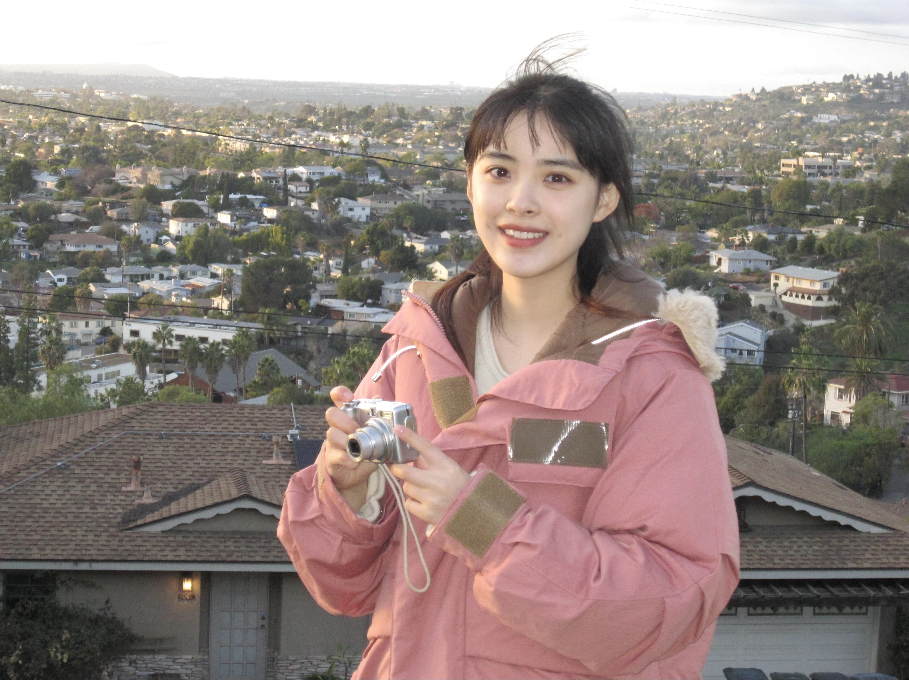

# Hi, Nice to meet you!

My name is Jiarui Yu, or you can call me Candice.

I have B.S. and M.S. degrees in Actuarial Science from UC Santa Barbara, and I am pursuing an M.S. degree in Biostatistics at Columbia University. 

With expertise spanning from advanced data analytics to impactful social media marketing, I've been involved in pivotal research projects and have excelled in multiple actuarial exams. 

At UCSB, I not only achieved the highest GPA in my major but also actively contributed as a Publications Journalist for the Actuarial Association. 

Passionate about blending data-driven insights with practical solutions, I am constantly seeking opportunities to further innovate and contribute to the industry.

